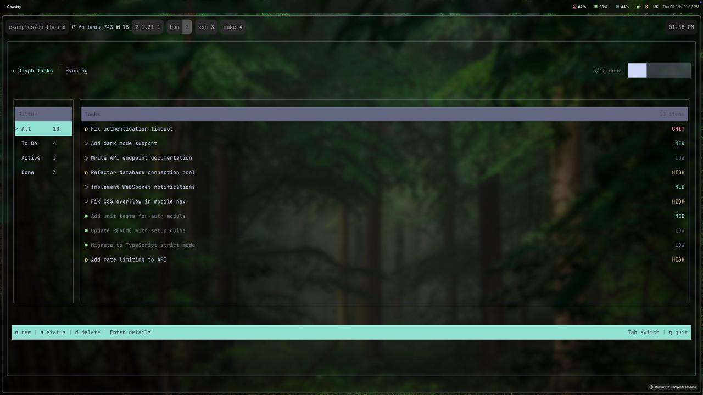

<p align="center">
  
</p>

<h1 align="center">Glyph</h1>

<p align="center">
  <strong>React renderer for terminal UIs</strong><br>
  <em>Flexbox layout. Keyboard-driven. Zero compromises.</em>
</p>

<p align="center">
  <a href="#quick-start">Quick Start</a> &bull;
  <a href="#components">Components</a> &bull;
  <a href="#hooks">Hooks</a> &bull;
  <a href="#styling">Styling</a> &bull;
  <a href="#examples">Examples</a>
</p>

<p align="center">
  
  
  
  
</p>

---

Build real terminal applications with React. Glyph provides a full component model with flexbox layout (powered by Yoga), focus management, keyboard input, and efficient diff-based rendering. Write TUIs the same way you write web apps.



### Features

| | |
|---|---|
| **Flexbox Layout** | Full CSS-like flexbox via Yoga &mdash; rows, columns, wrapping, alignment, gaps, padding |
| **Rich Components** | Box, Text, Input, Button, Select, ScrollView, List, Menu, Progress, Spinner, Toasts, Portal |
| **Focus System** | Tab navigation, focus scopes, focus trapping for modals |
| **Keyboard Input** | `useInput` hook, declarative `<Keybind>` component, vim-style bindings |
| **Smart Rendering** | Double-buffered framebuffer with character-level diffing &mdash; only changed cells are written |
| **True Colors** | Named colors, hex, RGB, 256-palette. Auto-contrast text on colored backgrounds |
| **Borders** | Single, double, rounded, and ASCII border styles |
| **TypeScript** | Full type coverage. Every prop, style, and hook is typed |

---

## Installation

```bash
# npm
npm install @nick-skriabin/glyph react

# pnpm
pnpm add @nick-skriabin/glyph react

# bun
bun add @nick-skriabin/glyph react
```

---

## Quick Start

```tsx
import React from "react";
import { render, Box, Text, Keybind, useApp } from "@nick-skriabin/glyph";

function App() {
  const { exit } = useApp();

  return (
    <Box style={{ border: "round", borderColor: "cyan", padding: 1 }}>
      <Text style={{ bold: true, color: "green" }}>Hello, Glyph!</Text>
      <Keybind keypress="q" onPress={() => exit()} />
    </Box>
  );
}

render(<App />);
```

Run it:

```bash
npx tsx app.tsx
```

---

## Components

### `<Box>`

Flexbox container. The fundamental building block.

```tsx
<Box style={{ flexDirection: "row", gap: 2, border: "single", padding: 1 }}>
  <Box style={{ flexGrow: 1, bg: "blue" }}>
    <Text>Left</Text>
  </Box>
  <Box style={{ flexGrow: 1, bg: "red" }}>
    <Text>Right</Text>
  </Box>
</Box>
```

### `<Text>`

Styled text content. Supports wrapping, alignment, bold, dim, italic, underline.

```tsx
<Text style={{ color: "yellowBright", bold: true, textAlign: "center" }}>
  Warning: something happened
</Text>
```

### `<Input>`

Text input field with cursor and placeholder support.

```tsx
<Input
  value={text}
  onChange={setText}
  placeholder="Type here..."
  style={{ border: "single", borderColor: "cyan" }}
/>
```

### `<Button>`

Focusable button with press handling and visual feedback.

```tsx
<Button
  onPress={() => console.log("clicked")}
  style={{ border: "single", borderColor: "cyan", paddingX: 2 }}
  focusedStyle={{ borderColor: "yellowBright", bold: true }}
>
  <Text>Submit</Text>
</Button>
```

Buttons participate in the focus system automatically. Press `Enter` or `Space` to activate.

### `<ScrollView>`

Scrollable container with keyboard navigation and clipping.

```tsx
<ScrollView style={{ flexGrow: 1, border: "single" }}>
  {items.map((item, i) => (
    <Box key={i}>
      <Text>{item}</Text>
    </Box>
  ))}
</ScrollView>
```

**Keyboard:** Arrow keys, `j`/`k`, `Ctrl+d`/`Ctrl+u` (half-page), `Ctrl+f`/`Ctrl+b` (full page), `G` (end), `gg` (top), `Home`/`End`, `PageUp`/`PageDown`.

Supports controlled mode with `scrollOffset` and `onScroll` props.

### `<List>`

Keyboard-navigable selection list with a render callback.

```tsx
<List
  count={items.length}
  onSelect={(index) => handleSelect(items[index])}
  disabledIndices={new Set([2, 5])}
  renderItem={({ index, selected, focused }) => (
    <Box style={selected && focused ? { bg: "cyan" } : {}}>
      <Text style={selected ? { bold: true } : {}}>
        {selected ? "> " : "  "}{items[index]}
      </Text>
    </Box>
  )}
/>
```

Focusable. `Up`/`Down` to navigate, `Enter` to select. Disabled indices are skipped.

### `<Menu>`

Styled menu built on `<List>`. Accepts structured items with labels, values, and disabled state.

```tsx
<Menu
  items={[
    { label: "New File", value: "new" },
    { label: "Open File", value: "open" },
    { label: "Export", value: "export", disabled: true },
    { label: "Quit", value: "quit" },
  ]}
  onSelect={(value) => handleAction(value)}
  highlightColor="yellow"
/>
```

### `<Select>`

Dropdown select with keyboard navigation and type-to-filter search.

```tsx
const [lang, setLang] = useState<string | undefined>();

<Select
  items={[
    { label: "TypeScript", value: "ts" },
    { label: "JavaScript", value: "js" },
    { label: "Rust", value: "rust" },
    { label: "Go", value: "go" },
    { label: "COBOL", value: "cobol", disabled: true },
  ]}
  value={lang}
  onChange={setLang}
  placeholder="Pick a language..."
  maxVisible={6}
  highlightColor="yellow"
/>
```

Focusable. `Enter`/`Space`/`Down` to open, `Up`/`Down` to navigate, `Enter` to confirm, `Escape` to close. Type characters to filter items when open. Disabled items are skipped.

Props: `items`, `value`, `onChange`, `placeholder`, `maxVisible`, `highlightColor`, `searchable`, `style`, `focusedStyle`, `dropdownStyle`, `disabled`.

### `<FocusScope>`

Focus trapping for modals and overlays.

```tsx
<FocusScope trap>
  <Input value={v} onChange={setV} />
  <Button onPress={submit}>
    <Text>OK</Text>
  </Button>
</FocusScope>
```

### `<Portal>`

Renders children in a fullscreen absolute overlay. Useful for modals and dialogs.

```tsx
<Portal>
  <Box style={{ width: "100%", height: "100%", justifyContent: "center", alignItems: "center" }}>
    <Box style={{ width: 40, border: "double", bg: "black", padding: 1 }}>
      <Text>Modal content</Text>
    </Box>
  </Box>
</Portal>
```

### `<Keybind>`

Declarative keyboard shortcut. Renders nothing.

```tsx
<Keybind keypress="ctrl+s" onPress={save} />
<Keybind keypress="escape" onPress={close} />
<Keybind keypress="q" onPress={() => exit()} />
```

### `<Progress>`

Determinate or indeterminate progress bar. Uses `useLayout` to measure actual width and renders block characters.

```tsx
<Progress value={0.65} showPercent />
<Progress indeterminate label="Loading" />
```

Props: `value` (0..1), `indeterminate`, `width`, `label`, `showPercent`, `filled`/`empty` (characters).

### `<Spinner>`

Animated spinner with configurable frames. Cleans up timers on unmount.

```tsx
<Spinner label="Loading..." style={{ color: "green" }} />
<Spinner frames={["|", "/", "-", "\\"]} intervalMs={100} />
```

### `<ToastHost>` + `useToast()`

Lightweight toast notifications rendered via Portal. Wrap your app in `<ToastHost>`, then push toasts from anywhere with `useToast()`.

```tsx
function App() {
  const toast = useToast();
  return <Keybind keypress="t" onPress={() =>
    toast({ message: "Saved!", variant: "success" })
  } />;
}

render(<ToastHost position="top-right"><App /></ToastHost>);
```

Variants: `"info"`, `"success"`, `"warning"`, `"error"`. Auto-dismiss after `durationMs` (default 3000).

### `<Spacer>`

Flexible space filler. Pushes siblings apart.

```tsx
<Box style={{ flexDirection: "row" }}>
  <Text>Left</Text>
  <Spacer />
  <Text>Right</Text>
</Box>
```

---

## Hooks

### `useInput(handler)`

Listen for all keyboard events.

```tsx
useInput((key) => {
  if (key.name === "escape") close();
  if (key.ctrl && key.name === "s") save();
});
```

### `useFocus(nodeRef)`

Get focus state for a node.

```tsx
const ref = useRef(null);
const { focused, focus } = useFocus(ref);

<Box ref={ref} focusable>
  <Text style={focused ? { color: "cyan" } : {}}>
    {focused ? "* focused *" : "not focused"}
  </Text>
</Box>
```

### `useLayout(nodeRef)`

Subscribe to a node's computed layout.

```tsx
const ref = useRef(null);
const layout = useLayout(ref);

// layout: { x, y, width, height, innerX, innerY, innerWidth, innerHeight }
```

### `useApp()`

Access app-level utilities.

```tsx
const { exit, columns, rows } = useApp();
```

---

## Styling

All components accept a `style` prop. Glyph uses Yoga for flexbox layout, so the model is familiar if you've used CSS flexbox or React Native.

### Layout

| Property | Type | Description |
|----------|------|-------------|
| `width`, `height` | `number \| "${n}%"` | Dimensions |
| `minWidth`, `minHeight` | `number` | Minimum dimensions |
| `maxWidth`, `maxHeight` | `number` | Maximum dimensions |
| `padding` | `number` | Padding on all sides |
| `paddingX`, `paddingY` | `number` | Horizontal / vertical padding |
| `paddingTop`, `paddingRight`, `paddingBottom`, `paddingLeft` | `number` | Individual sides |
| `gap` | `number` | Gap between flex children |

### Flexbox

| Property | Type | Default |
|----------|------|---------|
| `flexDirection` | `"row" \| "column"` | `"column"` |
| `flexWrap` | `"nowrap" \| "wrap"` | `"nowrap"` |
| `justifyContent` | `"flex-start" \| "center" \| "flex-end" \| "space-between" \| "space-around"` | `"flex-start"` |
| `alignItems` | `"flex-start" \| "center" \| "flex-end" \| "stretch"` | `"stretch"` |
| `flexGrow` | `number` | `0` |
| `flexShrink` | `number` | `0` |

### Positioning

| Property | Type | Description |
|----------|------|-------------|
| `position` | `"relative" \| "absolute"` | Positioning mode |
| `top`, `right`, `bottom`, `left` | `number \| "${n}%"` | Offsets |
| `inset` | `number \| "${n}%"` | Shorthand for all four edges |
| `zIndex` | `number` | Stacking order |

### Visual

| Property | Type | Description |
|----------|------|-------------|
| `bg` | `Color` | Background color |
| `border` | `"none" \| "single" \| "double" \| "round" \| "ascii"` | Border style |
| `borderColor` | `Color` | Border color |
| `clip` | `boolean` | Clip overflowing children |

### Text

| Property | Type | Description |
|----------|------|-------------|
| `color` | `Color` | Text color |
| `bold` | `boolean` | Bold text |
| `dim` | `boolean` | Dimmed text |
| `italic` | `boolean` | Italic text |
| `underline` | `boolean` | Underlined text |
| `wrap` | `"wrap" \| "truncate" \| "ellipsis" \| "none"` | Text wrapping mode |
| `textAlign` | `"left" \| "center" \| "right"` | Text alignment |

### Colors

Colors can be specified as:

- **Named:** `"red"`, `"green"`, `"blueBright"`, `"whiteBright"`, etc.
- **Hex:** `"#ff0000"`, `"#1a1a2e"`
- **RGB:** `{ r: 255, g: 0, b: 0 }`
- **256-palette:** `0`&ndash;`255`

Text on colored backgrounds automatically picks black or white for contrast when no explicit color is set.

---

## `render(element, options?)`

Mount a React element to the terminal.

```tsx
const app = render(<App />, {
  stdout: process.stdout,
  stdin: process.stdin,
  debug: false,
});

app.unmount(); // Tear down
app.exit();    // Unmount and exit process
```

---

## Examples

```bash
# Clone and install
git clone <repo-url> && cd glyph
pnpm install && pnpm build

# Run examples
pnpm --filter basic-layout dev      # Flexbox layout demo
pnpm --filter modal-input dev       # Modal, input, focus trapping
pnpm --filter scrollview-demo dev   # Scrollable content
pnpm --filter list-demo dev         # Keyboard-navigable list
pnpm --filter menu-demo dev         # Styled menu
pnpm --filter select-demo dev      # Dropdown select with search
pnpm --filter dashboard dev        # Full task manager (all components)
pnpm --filter showcase dev          # Progress, Spinner, Toasts
```

---

## Architecture

```
src/
├── reconciler/    React reconciler (host config + GlyphNode tree)
├── layout/        Yoga-based flexbox + text measurement
├── paint/         Framebuffer, character diffing, borders, colors
├── runtime/       Terminal raw mode, key parsing, OSC handling
├── components/    Box, Text, Input, Button, ScrollView, List, Menu, ...
├── hooks/         useInput, useFocus, useLayout, useApp
└── render.ts      Entry point tying it all together
```

**Render pipeline:** React reconciler builds a GlyphNode tree &rarr; Yoga computes flexbox layout &rarr; painter rasterizes to a framebuffer &rarr; diff engine writes only changed cells to stdout.

---

## License

MIT

---

<p align="center">
  <sub>Built with React &bull; Yoga &bull; a lot of ANSI escape codes</sub>
</p>
